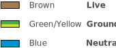
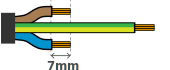

# How to install your Heating Element - 2800 and 3200W foldback.

## What you will need.

**Duration:** 15 minutes

This section of the manual will explain to you how to install your heating element in a kettle using a BrewBlox heating element mounting kit.

 <figure class = "info-block">
    

        
<svg id="include ../img/icon_warningdark.svg" class= "image.icon"></scg> 
 WARNING! 

        
Always consult a qualified electrician to install your heating element and to connect it to your control panel. Always use a ground fault protected outlet or include a GFCI/RCD in your control panel. 

    

</figure>

| Parts                                                                    | Tools                                                                        |
| :----------------------------------------------------------------------- | :--------------------------------------------------------------------------- |
| Kettle (Please check the element will fit within your kettle's diameter) | Wire Strippers                                                               |
| Cable 2.5mm2                                                  | Crimp Tool or Pliers                                                         |
| Enclosure Kit, consisting of:                                            | Philips Screwdriver                                                          |
| - Cable Gland                                                            | Adjustable Wrench (40mm)                                                     |
| - Enclosure Body                                                         | 1¼" Holepunch                                                                |
| - Enclosure Lid                                                          | Hand Held Drill (low speed, high torque)                                     |
| - Locknut                                                                | Metal cutting drill bit (9.5mm, cobalt head for stainless steel recommended) |
| - Eye lugs 3x                                                            | 8mm (5/16") Alan Key                                                         |
| - Red O-ring (size 218)                                                  | Optional: Hammer and Centre Punch Guide Drill Bit.                           |
| - Thin white silicone washer                                             |                                                                              |

## Legend

## Preparation: Installing the Eye Lugs to the Cable

    
 
 <b>Strip</b>&nbsp;5cm off the cable jacket 
 <svg src="../img/cables-strip_step1.svg"></svg> 

    
 
  <b>Shorten</b>&nbsp;the brown (live) and blue (neutral) wires to 3cm
<svg href="../img/cables-strip_step2.svg"></svg>

        
    

            
 <b>Strip</b>&nbsp;7mm off all 3 wire insulations

        
        
        
        

    

    

        
  <b>Crimp</b>&nbsp;an eye lug to each cable.   <b>Pull </b>&nbsp;to test that they are&nbsp;<b>fastened well</b>

            
     

## Installing the Enclosure

    .step
        //Step 1
        .wide
            
   
                //Left column
                .subwide 
                    .caption
                        p
                    .image
                        include ../img/step_1_composite.svg
                //Right column
                .subwide
                    .caption
                        //This is here to make it align.
                        p.nocount
                    .caption
                        .image.icon
                            include ../img/icon_screwdriver.svg
                        p.nocount <b>Screw</b> cable gland into enclosure lid
                    .caption
                        .image.icon
                            include ../img/icon_arrow_down.svg
                        p.nocount <b>Insert cable</b> through cable gland
                    .caption
                        .image.icon
                            include ../img/icon_exclamationmark.svg
                        p.nocount <b>Do not tighten</b> the cable gland pressure dome yet! This is the very last step...
                

                          

    .step
        //Step 2
        .caption
            .image.icon
                include ../img/icon_screwdriver.svg
            p <b>Screw</b> brown wire (live) to the element.
        .image
            .resize
                include ../img/heater_element_screw_live.svg
    .step
        //Step 3
        .caption
            .image.icon
                include ../img/icon_anticlockwise90.svg
            p <b>Bend</b> the eyelug 90°
        .image
            .resize
                include ../img/heater_element_bend_live.svg

    .step
        //Step 4
        .caption
            .image.icon
                include ../img/icon_screwdriver.svg
            p <b>Screw</b> blue wire (neutral) to the element.
        .image
            .resize
                include ../img/heater_element_screw_neutral.svg
    .step
        //Step 5
        .caption
            .image.icon
                include ../img/icon_anticlockwise90.svg
            p <b>Bend</b> the eyelug 90°
        .image
            .resize
                include ../img/heater_element_bend_neutral.svg

    .step
        //Step 6
        .caption
            .image.icon
                .rotate
                    .rotate
                        include ../img/icon_arrow_down.svg
            p <b>Remove</b> the tick gasket that came with the heating element. It is not used.
        .image
            .resize
                include ../img/heater_element_removing_washer.svg
    .step
        //Step 7
        .caption
            .image.icon
                include ../img/icon_arrow_down.svg
            p <b>Place</b> thin white gasket inside the housing
        .image
            .resize
                .rotate 
                    include ../img/step_7_composite.svg

    .step
        //Step 8
        .caption
            .image.icon
                include ../img/icon_arrow_down.svg
            p <b>Insert</b> the element through the enclosure housing.
        .image
            .resize
                include ../img/step_8_composite.svg
    .step
        //Step 9
        .caption
            .image.icon
                include ../img/icon_screwdriver.svg
            p <b>Screw</b> the grounding eye lug to housing with the short bolt (M4)
        .image
            .resize
                include ../img/step_9_composite.svg

    .step
        //Step 10
        .caption
            .image.icon
                include ../img/icon_arrow_down.svg
            p <b>Put</b> the Red ring O-ring (size: 218) around the thread of the element. It will press against the kettle to the seal.
        .image
            .resize
                include ../img/step_10_composite.svg
    .step
        //Step 11
        .caption
            .image.icon
                include ../img/icon_Holepunch.svg
            p <b>Drill</b> a 9.5mm pilot hole and <b>punch</b> a hole in your kettle with 1⅜ hole punch (32.5mm). It is recommended to cool your drill with oil or running water.
        .image
            include ../img/kettle_holepunch_zoomed.svg

    .step
        //Step 12
        .caption
            .image.icon
                .rotate
                    include ../img/icon_arrow_down.svg
            p <b>Insert</b> the element through the kettle.
        .image
            include ../img/kettle_bare_element.svg
    .step
        //Step 13
        .caption
            .image.icon
                include ../img/icon_twist.svg
            p <b>Screw</b> the locknut on and tighten it until it flattens the kettle wall.
        .image
            include ../img/kettle_locknut.svg

    .step
        //Step 14
        .caption
            .image.icon
                include ../img/icon_drops.svg
            p <b>Fill</b> the kettle with water. Check for leaks for at least 15 minutes.
        .image
            .fixedsize
                include ../img/kettle_submerge.svg
    .step
        //Step 15
        .caption
            .image.icon
                include ../img/icon_twist.svg
            p <b>Screw</b>  the lid onto housing first, then tighten cable gland dome. Congratulations, you are done.
        .image
            .fixedsize
                include ../img/step_15_composite.svg

