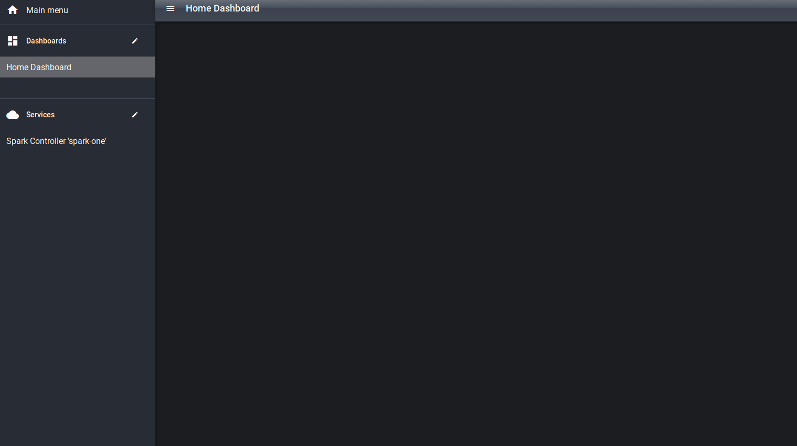

# Adding services

After you've followed the [Getting Started guide](./startup.md), you may want to connect your second or third Spark. <br>
This guide walks you through this process.

## What you will need

* Existing BrewBlox installation
* BrewPi Spark
* Micro-USB to USB cable

## Step 1: Stop your system

You'll be changing the configuration of your BrewBlox system. For the changes to take effect, you must stop and start your system.
To stop it, navigate to the directory you chose during the installation (default: `./brewblox`), and run the following command in your terminal:

```bash
brewblox-ctl down
```

## Step 2: Flash the firmware

::: warning
Make sure no other Sparks are connected over USB while you're flashing your controller.
:::

Navigate to the directory you chose during the installation (default: `./brewblox`), and run the following commands in your terminal:

```bash
brewblox-ctl flash
brewblox-ctl bootloader
brewblox-ctl wifi
```

Follow the instructions until the menu exits.

## Step 3: Add a service in docker-compose.yml

Your `docker-compose.yml` file (located in the directory you chose during installation), contains the configuration for the Docker containers in your BrewBlox installation.

If you open it, you'll see a list of services in the [YAML](https://www.tutorialspoint.com/yaml/yaml_introduction.htm) markup language.

Among them is the service that manages your first Spark. Its configuration will look something like:

```yaml
  spark-one:
    image: brewblox/brewblox-devcon-spark:rpi-${BREWBLOX_RELEASE:-stable}
    privileged: true
    depends_on:
      - eventbus
      - datastore
    restart: unless-stopped
    labels:
      - "traefik.port=5000"
      - "traefik.frontend.rule=PathPrefix: /spark-one"
    command: >
      --name=spark-one
```

To create a new one, copy this block, but change the name from `spark-one` to something else. The name of the service in YAML, the traefik rule, and the value of the `--name` argument must all be the same.

Example (including old service):

```yaml
  spark-one:
    image: brewblox/brewblox-devcon-spark:rpi-${BREWBLOX_RELEASE:-stable}
    privileged: true
    depends_on:
      - eventbus
      - datastore
    restart: unless-stopped
    labels:
      - "traefik.port=5000"
      - "traefik.frontend.rule=PathPrefix: /spark-one"
    command: >
      --name=spark-one

  spark-two:
    image: brewblox/brewblox-devcon-spark:rpi-${BREWBLOX_RELEASE:-stable}
    privileged: true
    depends_on:
      - eventbus
      - datastore
    restart: unless-stopped
    labels:
      - "traefik.port=5000"
      - "traefik.frontend.rule=PathPrefix: /spark-two"
    command: >
      --name=spark-two
```

## Step 4: Connect to a specific Spark

By default, a Spark service will connect to the first Spark controller it can find. If you're using multiple Sparks, you want each service to connect to the same controller every time.

You can do this by using the `--device-host` or the `--device-id` command. Services are independent: you can use `--device-host` for one service, and `--device-id` for the other.

### By host/IP

`--device-host` takes a host name or IP address as value. If you've connected your Spark to WiFi, it will show its IP address on the display.

Update the `command` section of both Spark services in your `docker-compose.yml` to add the IP addresses.

Example (rest of config left out):

```yaml
  spark-one:
    ...
    command: >
      --name=spark-one
      --device-host=192.168.0.60

  spark-two:
    ...
    command: >
      --name=spark-two
      --device-host=192.168.0.65
```

### By serial number


`--device-id` uses the unique serial number of your Spark controller. While your Spark controller is connected over USB, you can get its serial number by running the following command in your terminal:

```bash
docker run --privileged brewblox/brewblox-devcon-spark:rpi-stable --list-devices
```

Example output (SER is the serial number):

```bash
pi@brewpipi:~/brewblox $ docker run --privileged brewblox/brewblox-devcon-spark:rpi-stable --list-devices
2019/02/01 10:41:05 INFO     brewblox_service.service        Creating [spark] application
2019/02/01 10:41:05 INFO     __main__                        Listing connected devices: 
2019/02/01 10:41:05 INFO     __main__                        >> /dev/ttyACM0 | P1 - P1 Serial | USB VID:PID=2B04:C008 SER=300045000851353532343835 LOCATION=1-1.2:1.0
```

Update the `command` section of both Spark services in your `docker-compose.yml` to add the serial numbers.

Example (rest of config left out):

```yaml
  spark-one:
    ...
    command: >
      --name=spark-one
      --device-id=300045000851353532343835

  spark-two:
    ...
    command: >
      --name=spark-two
      --device-id=3f0025000851353532343835
```

## Step 5: Add the service in the UI

When adding your service, the `Service ID` field must match the name you gave the service in `docker-compose.yml`. The `Service name` field is free.


