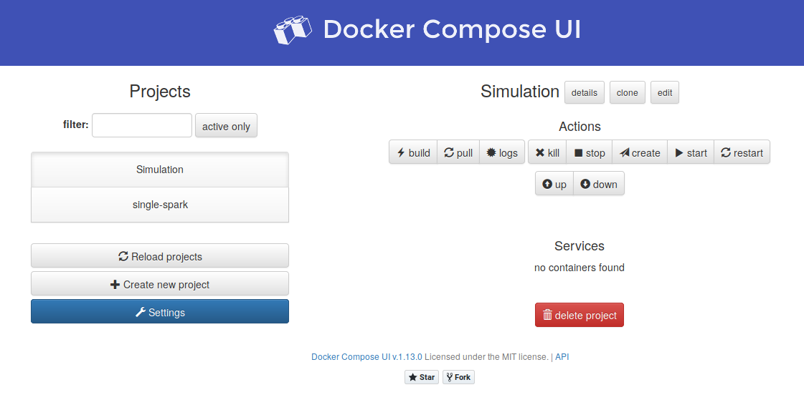

# Getting Started

This guide describes how to install the BrewBlox system on a Raspberry Pi. </br>
The default device for the BrewBlox system is the BrewPi Spark, but you can try this tutorial without it.

For more advanced users, there are alternative ways for configuring and using the system. These are described in the [Advanced](./advanced.md) page.

## What you will need

Always:
* Laptop or desktop computer
* [Raspberry Pi 3](https://www.raspberrypi.org/products/) minicomputer
* Raspberry Pi power supply (5V to micro USB)
* MicroSD card
* MicroSD card reader
* USB keyboard
* USB mouse
* HDMI monitor or tv
* HDMI cable
* Wifi network or ethernet cable

When connecting the BrewPi Spark
* BrewPi Spark
* Micro-USB to USB cable

::: tip
You can also install BrewBlox on a desktop computer, or install the Raspberry Pi using SSH. </br>
See the [Advanced](./advanced.md) page for instructions.
:::

## Step 1: Format the microSD card

Download the required software:
* [Raspbian OS](https://www.raspberrypi.org/downloads/raspbian/)
* [Etcher](https://etcher.io/) for writing the image to the microSD card.

Insert your microSD card in the card reader, and connect the reader to your computer.

Now use Etcher to write it to your microSD card. Make sure to safely eject the microSD card before removing it from the card reader.


For more information, see the [official Raspberry install guide](https://www.raspberrypi.org/documentation/installation/installing-images/README.md).

## Step 2: Install the Raspberry Pi

::: warning
Make sure the power supply is disconnected at this point.
:::

Insert the microSD card into your Pi, and connect the keyboard, mouse, and monitor.

Now connect the power supply. The Pi will start automatically.

Wait for the Pi to finish starting up, and follow the first-time startup instructions. Make sure to connect to the internet, either using WiFi, or through an ethernet cable.


## Step 3: Install BrewBlox

Open the terminal, and run the following command:

```
curl -sSL https://brewblox.netlify.com/install | sh
```

Restart your Pi for the installation to complete.

## Step 4: Start a service

After installing BrewBlox, any time you (re)start the Pi, the Compose UI will start automatically.

This UI can be used to manage your BrewBlox system. To view it, navigate to `http://raspberrypi:5000` using either the Pi browser, or any other computer in the same network.

It may take a few minutes after startup for the UI to be available.

To test your system, select the `Simulation` project on the left side, and click the `up` button on the right side.



The simulation project will now start up. This will take a few minutes the first time, but will be much quicker afterwards.

When the Compose UI displays the active containers, you can visit the BrewBlox UI at `http://raspberrypi`.

## Step 5: Connect the BrewPi Spark

::: warning
Only one project can run at a time. </br>
If the `Simulation` project is still running, stop it using the `down` button.
:::

To start using the BrewPi spark, connect the Spark to the Pi using a micro-USB to USB cable.

Now start the `Single-Spark` project using the `up` button.

After the project is done starting up, you can use the BrewBlox UI at `http://raspberrypi` to configure and monitor your Spark.


